# LLM Proxy 技术方案报告

## 1. 项目概述

### 1.1 项目简介

**LLM Proxy** 是一个高性能的 API 代理服务，核心功能是将本地 LLM 模型（如 Qwen3-Coder、GLM-4 等）适配为 **Claude API 格式**，使得原本使用 Claude API 的客户端可以无缝切换到本地模型服务。

### 1.2 核心价值

| 特性 | 描述 |
|------|------|
| **API 兼容性** | 完全兼容 Claude Messages API 格式 |
| **模型映射** | 自动将 Claude 模型名映射到本地模型 |
| **工具调用** | 完整支持函数/工具调用（Function Calling） |
| **流式响应** | 支持 SSE 流式响应，带错误恢复机制 |
| **Token 计数** | 支持自定义 tokenizer 精确计算 token |
| **容器化部署** | Docker 优化，支持宿主机网络模式 |

### 1.3 技术栈

```
┌─────────────────────────────────────────────────────────────┐
│                      技术栈概览                              │
├─────────────────┬───────────────────────────────────────────┤
│ Web 框架        │ FastAPI 0.124.2                           │
│ ASGI 服务器     │ Uvicorn 0.38.0                            │
│ LLM 集成        │ LiteLLM 1.80.9                            │
│ 数据验证        │ Pydantic 2.12.5                           │
│ HTTP 客户端     │ httpx 0.28.1 / aiohttp 3.13.2             │
│ Token 计算      │ tokenizers 0.22.1 / tiktoken 0.12.0       │
│ 运行环境        │ Python 3.11                               │
│ 容器化          │ Docker + Docker Compose                   │
└─────────────────┴───────────────────────────────────────────┘
```

---

## 2. 系统架构

### 2.1 整体架构图

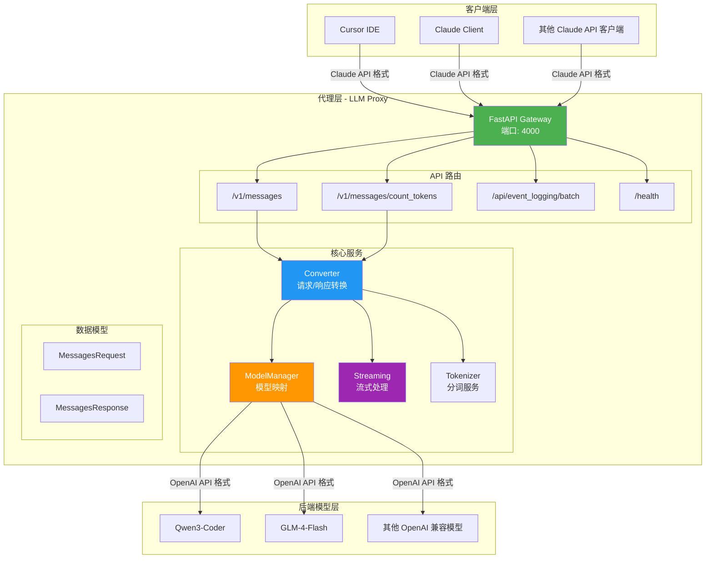

### 2.2 项目目录结构

```
llm_proxy/
├── app/                          # 应用主目录
│   ├── __init__.py              # 包初始化 & 版本信息
│   ├── config.py                # 配置管理（环境变量加载）
│   ├── constants.py             # 常量定义（角色、事件类型等）
│   │
│   ├── api/                     # API 路由层
│   │   ├── __init__.py          # 路由聚合
│   │   ├── messages.py          # 消息接口（核心）
│   │   ├── tokens.py            # Token 计数接口
│   │   ├── health.py            # 健康检查接口
│   │   └── event_logging.py     # 事件日志接口
│   │
│   ├── models/                  # 数据模型层
│   │   ├── __init__.py
│   │   ├── request.py           # 请求模型（Claude 格式）
│   │   ├── response.py          # 响应模型（Claude 格式）
│   │   └── event_logging.py     # 事件日志模型
│   │
│   ├── services/                # 业务服务层
│   │   ├── __init__.py
│   │   ├── converter.py         # 格式转换器（Anthropic ↔ LiteLLM）
│   │   ├── model_manager.py     # 模型管理与映射
│   │   ├── streaming.py         # 流式响应处理
│   │   └── tokenizer.py         # 分词器服务
│   │
│   └── utils/                   # 工具模块
│       ├── __init__.py
│       ├── errors.py            # 错误分类与处理
│       └── logging_utils.py     # 日志工具
│
├── tokenizers/                  # Tokenizer 文件目录
│   └── qwen3coder30b_tokenizer.json
│
├── logs/                        # 日志目录
├── main.py                      # 应用入口
├── Dockerfile                   # Docker 镜像配置
├── docker-compose.yml           # Docker Compose 配置
├── requirements.txt             # Python 依赖
└── README.md                    # 项目文档
```

---

## 3. 核心流程

### 3.1 请求处理流程图

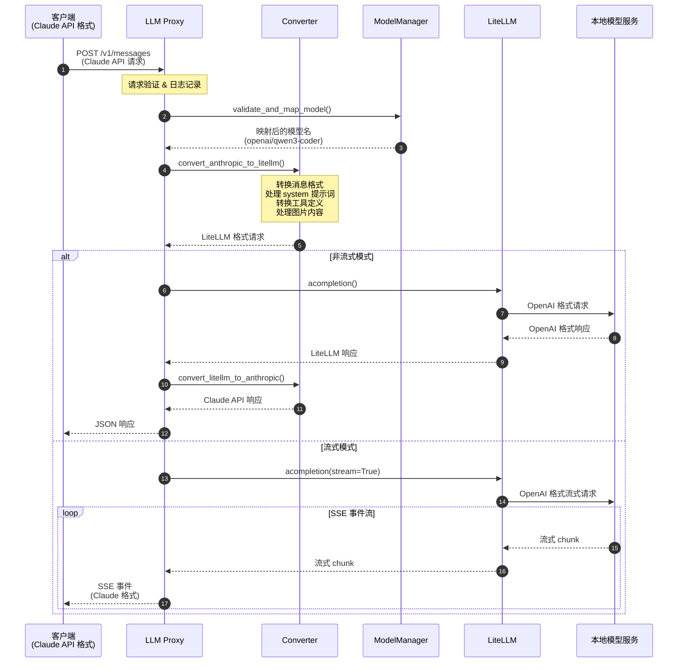

### 3.2 模型映射逻辑

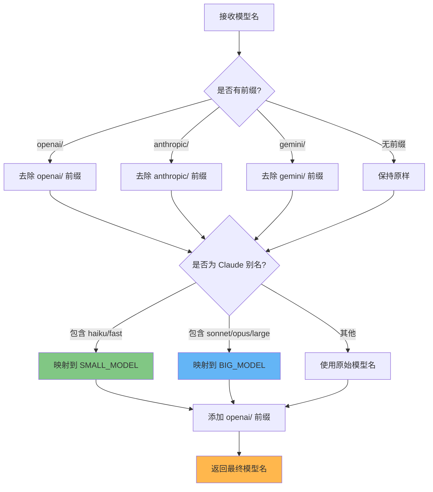

### 3.3 格式转换详解

#### 3.3.1 请求转换 (Anthropic → LiteLLM)

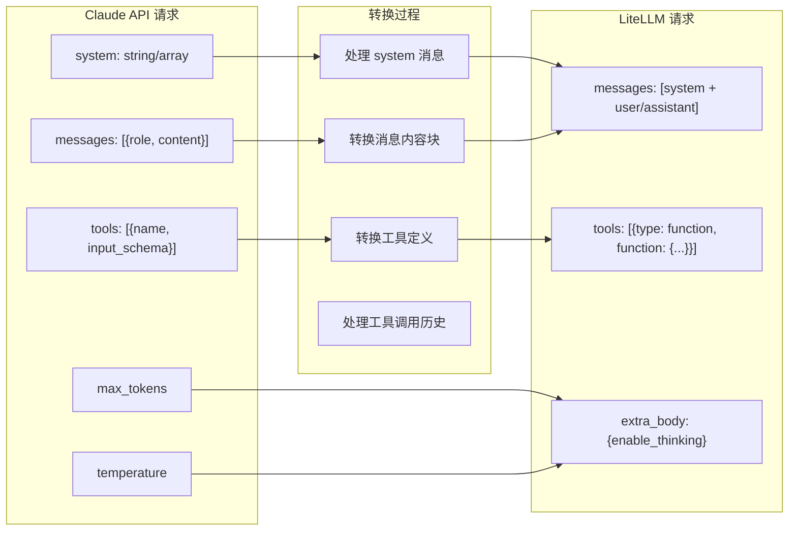

#### 3.3.2 内容块类型映射

| Claude 类型 | LiteLLM 类型 | 说明 |
|------------|-------------|------|
| `text` | `content` | 文本内容 |
| `image` | `image_url` | 图片 (base64) |
| `tool_use` | `tool_calls` | 工具调用 |
| `tool_result` | `tool` role message | 工具返回结果 |
| `thinking` | `reasoning_content` | 思考内容 |

---

## 4. 核心模块详解

### 4.1 配置管理 (config.py)

支持通过环境变量配置所有参数：

```python
┌─────────────────────────────────────────────────────────────────┐
│                       配置参数                                   │
├─────────────────────┬───────────────────┬───────────────────────┤
│ 参数名              │ 默认值             │ 说明                  │
├─────────────────────┼───────────────────┼───────────────────────┤
│ API_KEY             │ sk-faker          │ 后端模型 API Key      │
│ BASE_URL            │ http://....:29000 │ 后端模型服务地址      │
│ BIG_MODEL           │ qwen3-coder       │ 大模型名称            │
│ SMALL_MODEL         │ qwen3-coder       │ 小模型名称            │
│ HOST                │ 0.0.0.0           │ 监听地址              │
│ PORT                │ 4000              │ 监听端口              │
│ MAX_TOKENS_LIMIT    │ 16384             │ 最大输出 token        │
│ REQUEST_TIMEOUT     │ 90                │ 请求超时(秒)          │
│ WORKERS             │ 4                 │ Worker 进程数         │
│ FORCE_DISABLE_STREAM│ true              │ 强制禁用流式          │
│ TOKENIZER_FILE      │ tokenizers/...    │ 自定义分词器路径      │
└─────────────────────┴───────────────────┴───────────────────────┘
```

### 4.2 模型管理器 (model_manager.py)

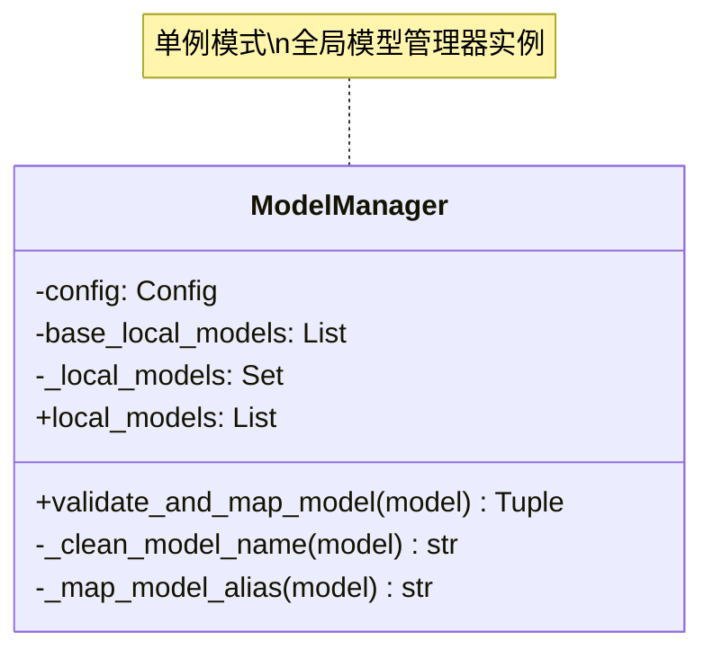

### 4.3 格式转换器 (converter.py)

核心功能：
1. **请求转换**: `convert_anthropic_to_litellm()`
2. **响应转换**: `convert_litellm_to_anthropic()`
3. **Schema 清理**: `clean_model_schema()` - 移除不支持的 JSON Schema 字段
4. **工具参数修复**: `validate_todowrite_tool_call()` - 修复特定工具的参数格式问题

### 4.4 流式处理器 (streaming.py)

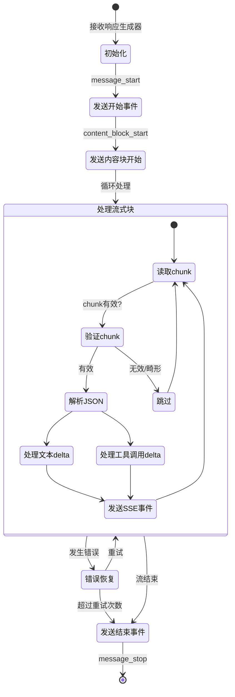

**错误恢复机制**:
- 最大连续错误次数: 10
- 最大畸形 chunk 数量: 20
- 支持 chunk 缓冲区组装
- 超时处理 (90秒)

### 4.5 分词器服务 (tokenizer.py)

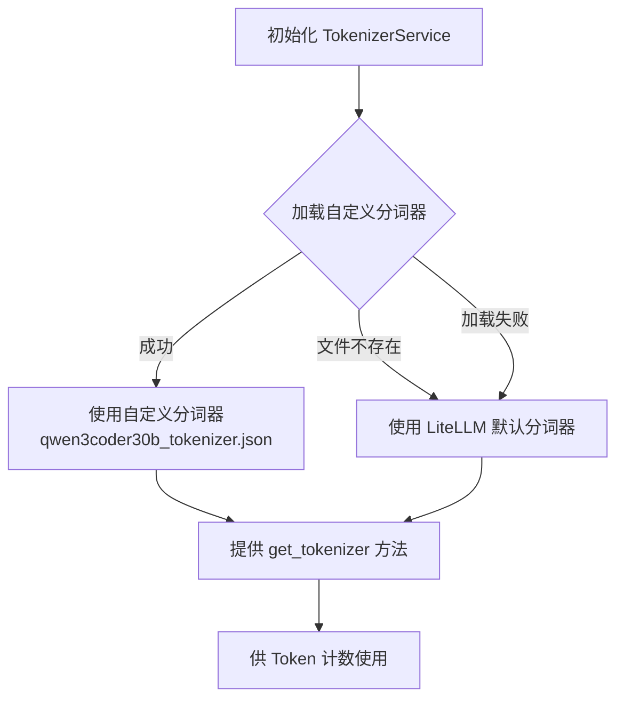

---

## 5. API 接口规范

### 5.1 消息接口

```
POST /v1/messages
```

**请求体** (Claude API 格式):

```json
{
  "model": "claude-3-5-sonnet-20241022",
  "max_tokens": 4096,
  "messages": [
    {
      "role": "user",
      "content": "Hello, how are you?"
    }
  ],
  "system": "You are a helpful assistant.",
  "tools": [...],
  "stream": false,
  "temperature": 0.7
}
```

**响应体** (Claude API 格式):

```json
{
  "id": "msg_xxx",
  "type": "message",
  "role": "assistant",
  "model": "claude-3-5-sonnet-20241022",
  "content": [
    {
      "type": "text",
      "text": "Hello! I'm doing well, thank you..."
    }
  ],
  "stop_reason": "end_turn",
  "usage": {
    "input_tokens": 25,
    "output_tokens": 150
  }
}
```

### 5.2 Token 计数接口

```
POST /v1/messages/count_tokens
```

### 5.3 健康检查接口

```
GET /health
GET /test-connection
GET /
```

### 5.4 事件日志接口

```
POST /api/event_logging/batch
```

---

## 6. 部署架构

### 6.1 Docker 部署架构

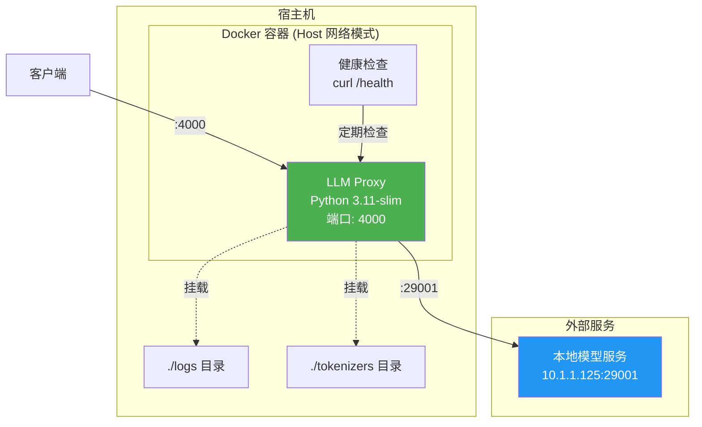

### 6.2 Docker Compose 配置

```yaml
services:
  llm-proxy:
    image: llm-proxy:latest
    network_mode: host          # 使用宿主机网络
    restart: unless-stopped
    environment:
      - API_KEY=sk-faker
      - BASE_URL=http://10.1.1.125:29001/v1
      - BIG_MODEL=glm-4.7-flash
      - SMALL_MODEL=glm-4.7-flash
      - PORT=4000
      - WORKERS=4
      - FORCE_DISABLE_STREAMING=true
    healthcheck:
      test: ["CMD", "curl", "-f", "http://localhost:4000/health"]
      interval: 30s
      timeout: 10s
      retries: 3
```

### 6.3 Dockerfile 优化

- **基础镜像**: `python:3.11-slim`
- **国内镜像源**: 清华大学 apt & PyPI 源
- **多阶段缓存**: 依赖与代码分离
- **健康检查**: 内置 curl 健康检查

---

## 7. 数据流图

### 7.1 非流式请求数据流

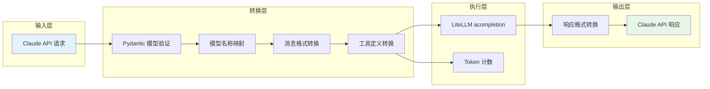

### 7.2 流式请求数据流

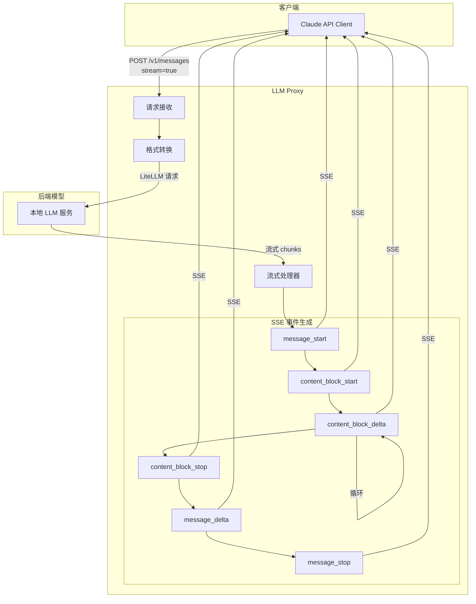

---

## 8. 错误处理机制

### 8.1 错误分类

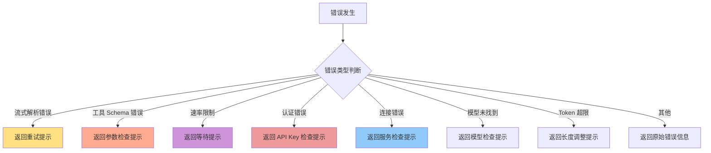

### 8.2 HTTP 状态码

| 状态码 | 场景 |
|--------|------|
| 200 | 请求成功 |
| 400 | 请求参数错误 |
| 401 | 认证失败 |
| 500 | 内部服务错误 |
| 503 | 后端服务不可用 |
| 504 | 请求超时 |

---

## 9. 性能优化

### 9.1 并发处理

- **多 Worker 模式**: 支持配置多个 Uvicorn worker 进程
- **异步 I/O**: 全异步实现，使用 `asyncio` + `aiohttp`
- **连接复用**: LiteLLM 内置连接池

### 9.2 内存优化

- **流式处理**: 大响应使用流式传输，避免内存溢出
- **Chunk 缓冲限制**: 最大 10KB 缓冲区
- **及时清理**: 处理完成后立即释放资源

### 9.3 网络优化

- **Host 网络模式**: Docker 使用宿主机网络，减少网络延迟
- **超时控制**: 可配置的请求超时 (默认 90s)
- **重试机制**: 流式请求最多重试 12 次

---

## 10. 监控与日志

### 10.1 日志级别

```
DEBUG  → 详细调试信息
INFO   → 正常运行信息 (默认)
WARNING→ 警告信息
ERROR  → 错误信息
```

### 10.2 关键日志点

| 日志类型 | 内容 |
|---------|------|
| 请求日志 | 方法、路径、原始模型、映射模型、消息数、工具数 |
| 模型映射 | 原始模型 → 映射模型 |
| Token 计数 | 输入 token 数量 |
| 响应日志 | 模型、停止原因、输入/输出 token、文本内容预览 |
| 工具调用 | 工具名称、ID、参数预览 |
| 错误日志 | 错误类型、堆栈信息 |

### 10.3 健康检查

```json
{
  "status": "healthy",
  "timestamp": "2026-01-26T10:30:00",
  "version": "2.5.0",
  "local_api_configured": true,
  "base_url": "http://10.1.1.125:29001/v1",
  "streaming_config": {
    "force_disabled": true,
    "emergency_disabled": false,
    "max_retries": 12
  }
}
```

---

## 11. 安全考虑

### 11.1 API Key 管理

- 通过环境变量注入，不硬编码
- 日志中脱敏处理
- 支持运行时验证

### 11.2 输入验证

- Pydantic 模型强类型验证
- 消息内容长度限制 (`MAX_TOKENS_LIMIT`)
- 工具 Schema 清理（移除不支持字段）

### 11.3 网络安全

- 仅监听指定端口
- 支持配置 CORS 头
- Docker 网络隔离（可选）

---

## 12. 扩展性设计

### 12.1 模型扩展

```python
# 在 model_manager.py 中添加新的模型映射
def _map_model_alias(self, clean_model: str) -> str:
    model_lower = clean_model.lower()
    
    # 添加新的映射规则
    if 'new-model' in model_lower:
        return self.config.new_model
    
    # ... 原有逻辑
```

### 12.2 API 扩展

```python
# 在 app/api/ 目录下添加新的路由文件
# 然后在 app/api/__init__.py 中注册

from .new_endpoint import router as new_router
api_router.include_router(new_router)
```

### 12.3 服务扩展

```python
# 在 app/services/ 目录下添加新的服务模块
# 遵循现有的单例模式设计
```

---

## 13. 总结

LLM Proxy 是一个设计良好、功能完整的 API 代理服务，具有以下特点：

1. **架构清晰**: 分层设计，职责明确
2. **功能完整**: 支持流式/非流式、工具调用、Token 计数
3. **容错性强**: 完善的错误处理和重试机制
4. **部署简单**: Docker 化部署，环境变量配置
5. **易于扩展**: 模块化设计，便于功能扩展

该项目成功实现了将本地 LLM 模型以 Claude API 格式对外提供服务的目标，是连接本地模型与 Claude 生态的桥梁。
